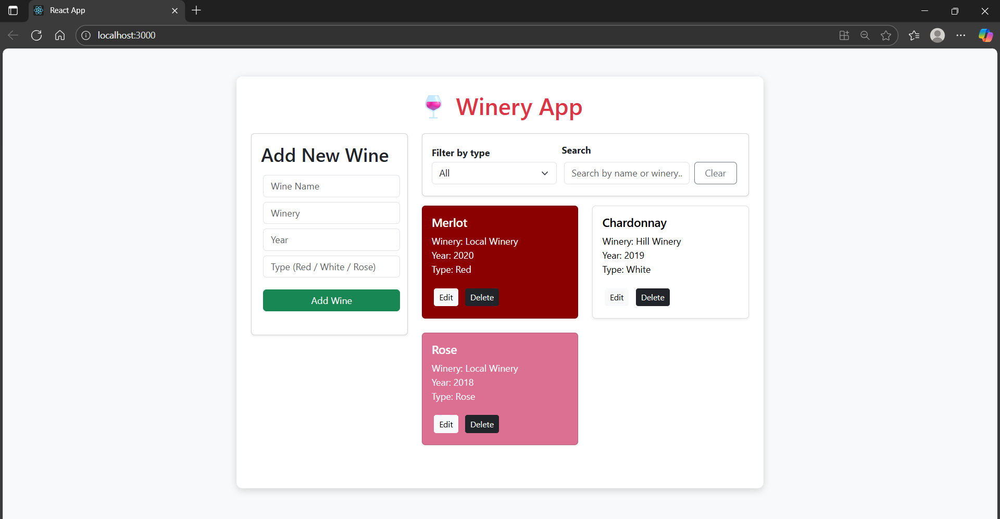
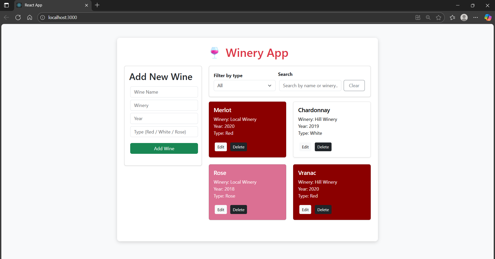
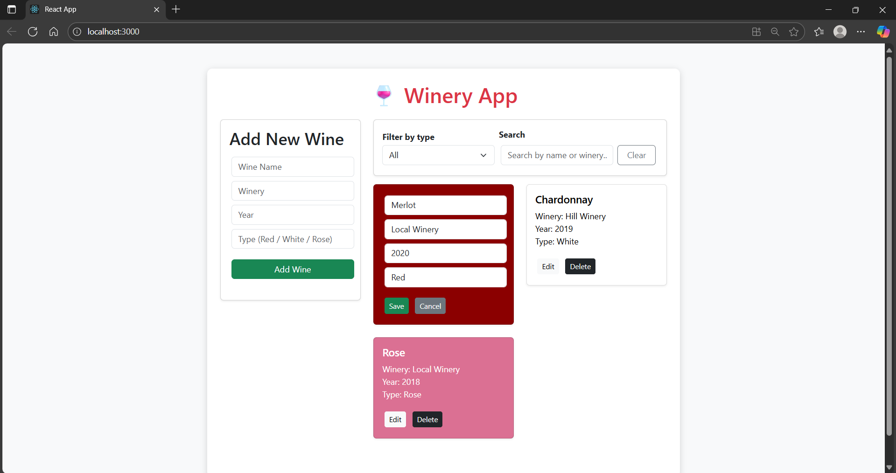
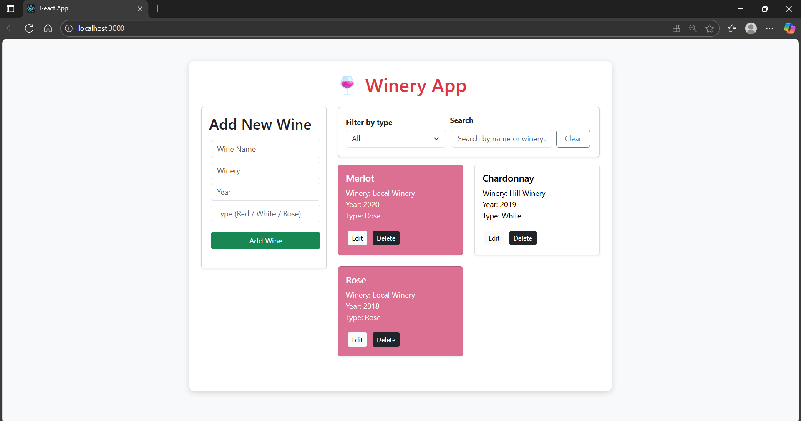
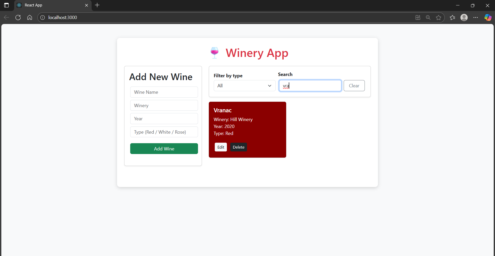
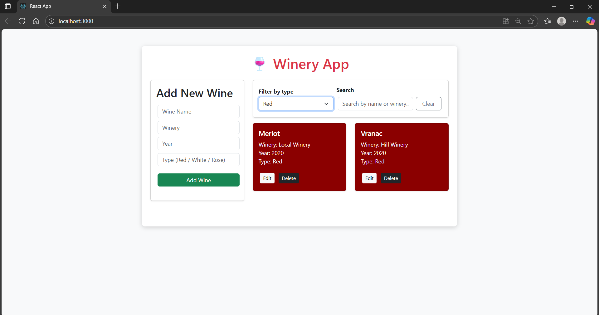

# 🍷 WineryApp

Simple full-stack CRUD app to manage wines.

**Stack:** 
· Backend: .NET 9 Web API (C#) 
· Frontend: React and Bootstrap 
· Testing: xUnit (tests)

---

## Screenshots of the app functionality

---

## Quick features
- Add / Edit / Delete wines  
- Filter & search (client-side)  
- Responsive UI with Bootstrap  
- Unit tests for backend (xUnit)

---

## Quick start (run locally)

### Requirements
- .NET 9 SDK  
- Node.js (>=16)
- The backend and frontend have to run simultaneously

### Run backend
# from repo root
dotnet run --project WineryApp.Api

### Run frontend
# from the repo root
cd frontend
npm start

### Testing
dotnet test
