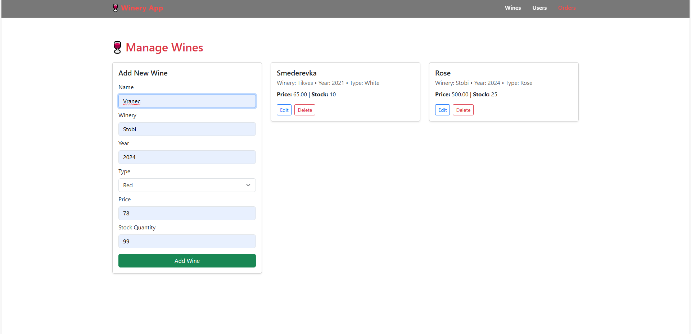
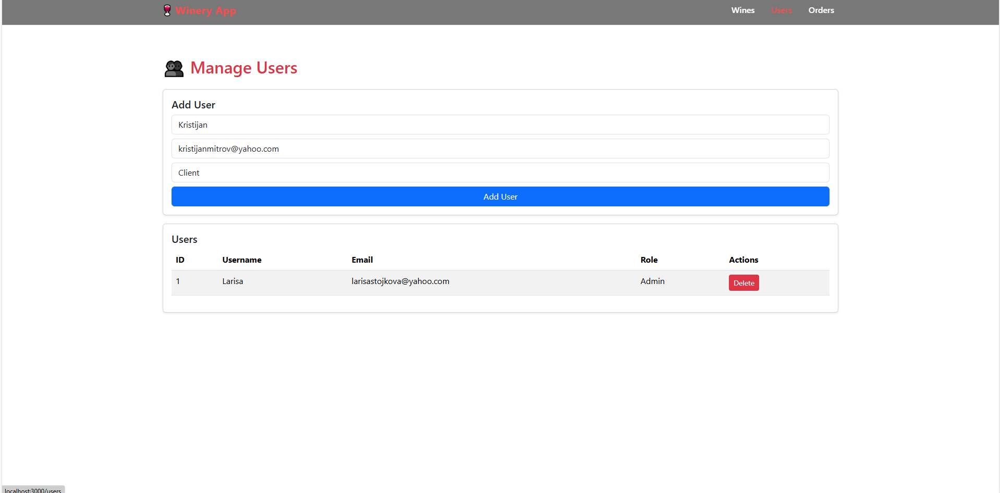
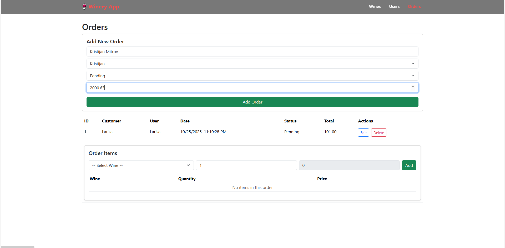

# 🍷 WineryApp

Full-stack Winery Management System built with ASP.NET Core, React, and SQL Server, featuring ERP-style modules for wines, users, and orders with real-time CRUD operations, analytics logic, and modern responsive UI.

**Stack:** 
· Backend: .NET 9 Web API (C#) 
· Frontend: React + Bootstrap + CSS 
· Database: Microsoft SQL Server (MSSQL) + Using SQL Server Management Studio (SSMS)
· Testing: xUnit (tests)

---

## Screenshots of the app functionality
- Home page

- Wine page

- Wines page after adding wine

- Users page

- Users page after adding user

- Orders and order items page

- Adding person to order items

- Adding wines on orders

---

## Quick features
- Add / Edit / Delete wines  
- Add / Delete users
- Add / Edit / Delete person ordering 
- Add / Delete wines in orders 
- Responsive UI with Bootstrap  
- Unit tests for backend (xUnit)

---

## Quick start (run locally)

### Requirements
- .NET 9 SDK  
- Node.js (>=16)
- The backend and frontend have to run simultaneously on different terminals so that the app has all the functionalities

### Run backend
- From app root
dotnet run --project WineryApp.Api

### Run frontend
- From app root
cd frontend
npm start

### Testing
- From app root
cd WineryApp.Tests
dotnet test

